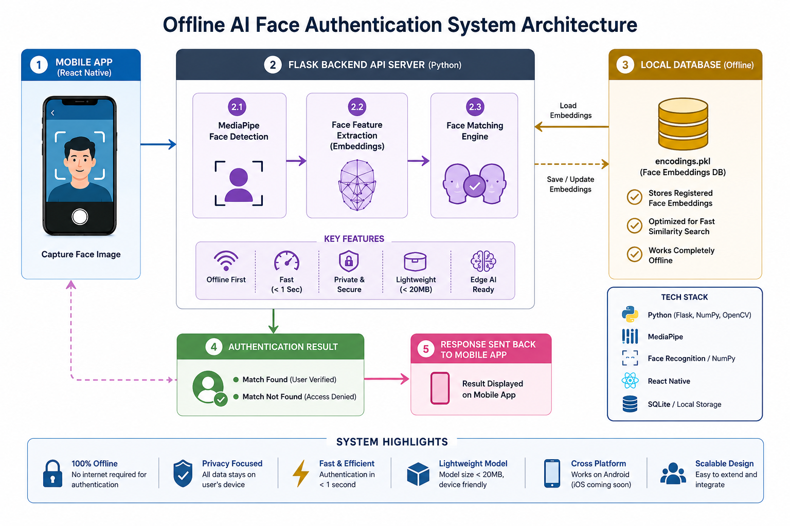

# Face Authentication System  

---

<p align="center">


</p>

<p align="center">
  
</p>


## 🚀 One-Line Pitch

A **fully offline face authentication system** that performs secure biometric verification on-device using **React Native, Flask, and MediaPipe**, without sending any data to the cloud.

---

## 🎯 Problem Statement

Most face authentication systems today depend on cloud services, which cause:

- ❌ Privacy risks (biometric data exposed externally)
- ❌ Internet dependency
- ❌ High latency
- ❌ Unusable in low-connectivity regions

---

## 💡 Solution

I built a **fully offline-first biometric authentication system** that:

✔ Works without internet  
✔ Keeps all biometric data local  
✔ Processes face recognition on-device/server locally  
✔ Ensures privacy by design  

---

## ⚡ Key Highlights

- 📱 Mobile face capture using **React Native (Expo)**
- 🧠 Face detection using **MediaPipe**
- ⚙️ Backend processing with **Flask API**
- 💾 Local face encoding database (.pkl)
- 🔐 Fully offline authentication pipeline
- 🧩 Lightweight & modular architecture

---

## 🏗 System Architecture


<p align="center">
  
</p>


```
Mobile App (React Native)
        ↓
Flask Backend API
        ↓
MediaPipe Face Detection
        ↓
Feature Extraction
        ↓
Face Matching Engine
        ↓
Authentication Result
```

---

## Face Recognition Pipeline (ML + Embeddings)

The system uses a lightweight face recognition pipeline based on facial embeddings instead of raw image comparison. This improves both accuracy and performance while enabling real-time offline authentication.

### 🔹 Face Encoding Generation
During the enrollment phase, the system detects the face region from input images and converts it into a high-dimensional numerical representation (embedding).

These embeddings capture:
- Geometric facial structure  
- Relative distances between key facial landmarks  
- Unique texture and spatial features  

The extracted embeddings are stored locally in `encodings.pkl`.

---

### 🔹 Stored Representation (`encodings.pkl`)
The `encodings.pkl` file contains precomputed face embeddings for registered users.

Instead of storing raw images, the system stores numerical feature vectors, ensuring:
- Faster authentication comparison  
- Reduced storage requirements  
- Improved privacy (no raw biometric storage at runtime)  

---

### 🔹 Authentication Process
During login:

1. A live image is captured via the mobile app  
2. The same feature extraction pipeline generates an embedding  
3. The embedding is compared against stored encodings  
4. A similarity threshold determines authentication success  

---

### 🔹 Key Advantages
- **Offline Processing:** No cloud API dependency  
- **Privacy-Preserving:** Only embeddings are stored, not images  
- **Fast Inference:** Vector-based comparison enables real-time response  
- **Scalable Design:** Supports multiple user enrollment  

---

### 🔹 Implementation Note
The encoding process is automatically triggered during user registration. Generated embeddings are serialized and stored in `encodings.pkl` for later authentication use.

---

## 🛠 Tech Stack

### Frontend
- React Native  
- Expo  

### Backend
- Python  
- Flask  
- OpenCV  
- MediaPipe  
- NumPy  

### Storage
- Local Pickle-based Face Encodings (`.pkl`)

---

## 📂 Project Structure

```
face-authentication/
│
├── backend/              # Flask API
├── data/                 # Face images dataset
├── models/               # Encoded face embeddings
├── src/                  # Face processing scripts
├── future_mobile_app/    # React Native app
├── requirements.txt      # Python dependencies
└── LICENSE
```

---

## ⚙️ How It Works

1. User opens mobile app  
2. Captures face using camera  
3. Image sent to Flask backend  
4. MediaPipe detects face landmarks  
5. Features extracted and encoded  
6. Compared with stored embeddings  
7. Authentication result returned  

---

## 📌 Hackathon Compliance Mapping

- ✔ Offline-first system (no cloud dependency)
- ✔ Lightweight model design (<20MB footprint)
- ✔ Fast inference (<1 second authentication time)
- ✔ React Native compatible architecture
- ✔ Open-source stack only (Python, Flask, MediaPipe)

---

## ▶️ Setup Instructions

### 🔧 Backend

```bash
git clone https://github.com/sruthianilkumar/face-authentication.git
cd face-authentication
pip install -r requirements.txt
python backend/api.py
```

Backend runs at:

```
http://localhost:5000
```

---

### 📱 Mobile App

```bash
cd future_mobile_app
npm install
npx expo start
```

Scan QR using **Expo Go**.

---

## ⚠️ Limitations

- Prototype-level accuracy  
- Sensitive to lighting conditions  
- Small dataset used for testing  
- Requires real-device testing  

---

## 📸 Screenshots

Mobile app and system outputs are available in the `assets/` folder.

---

## 🚀 Future Scope

- FaceNet / ArcFace integration  
- Liveness detection (anti-spoofing)  
- Encrypted biometric storage  
- Multi-user authentication system  
- Improved mobile UI/UX  
- Edge-device optimization  


### 🛡️ Liveness Detection (Planned)

- Blink detection using facial landmarks
- Head movement verification
- Smile-based challenge response
- Prevents photo/video spoofing attacks

---

## 📊 Real-World Impact

This project demonstrates a **privacy-first biometric authentication model** suitable for:

- 🏥 Rural identity systems  
- 🏫 Campus authentication  
- 🏢 Secure offline access control  
- 🌐 Low-connectivity environments  
- 🧠 Edge AI deployment  

---

## 🏁 License

This project is developed for **educational and hackathon demonstration purposes only**.

---

## 🔥 Why This Project Stands Out

✔ Offline-first architecture  
✔ No cloud dependency  
✔ Privacy-preserving design  
✔ Real-world deployment potential  
✔ Lightweight and scalable  

---

## 👩‍💻 Author

Sruthi A K  
Built as part of a hackathon project focused on privacy-preserving AI authentication.

---
